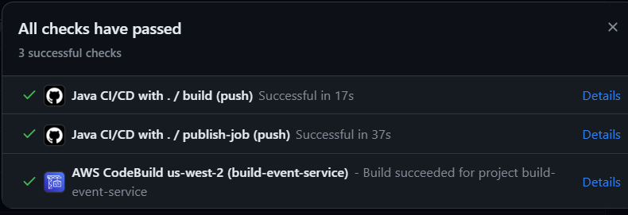
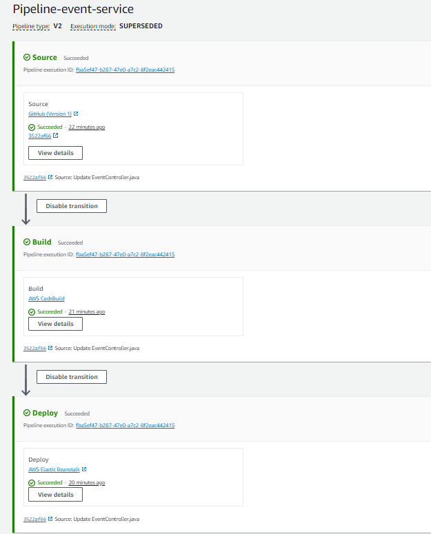

# EventService

This is a Maven Spring Boot application that implements a Continuous Integration/Continuous Deployment (CI/CD) pipeline on AWS. The project will be hosted in AWS and will be accessible via a URL for a short period of time.
The project also includes a build process on GitHub Actions for testing.

## Goal

The goal of this project is to automate the build, test, and deployment process to streamline the development flow. The resulting web service application will be hosted on AWS for a short period of time and contains functionality to respond to various requests.

## Technologies and Tools

- Java
- Spring Boot
- Maven
- AWS
- GitHub Actions
- MongoDB Atlas

## Features

- Retrieve event based on ID
- Retrieve all events
- Save a new event
- Update an existing event
- Delete an event

## How to Run the Project

To run this project locally, follow these steps:

1. Clone this repo to your local machine
2. Open the project in your favorite IDE (e.g., IntelliJ IDEA)
3. Run `mvn clean install` to build the project
4. Run `mvn spring-boot:run` to start the application

Note that you need to have Java and Maven installed on your machine to be able to run the project.

## CI/CD Pipeline

This project uses GitHub Actions to automate the build and test process. Each time a change is pushed to the repo, a series of tests are run to ensure that the code still works as expected. If all tests pass, the project is built and a JAR file is generated.

This JAR file can then be deployed to AWS to make the application available online.

## CI/CD Process

The CI/CD process for this project involves pushing to the GitHub repository, triggering a GitHub Actions workflow, and deploying through an AWS pipeline. Here's a step-by-step breakdown:

1. **Push to Repository**: Changes are made to the code and pushed to the GitHub repository.

2. **Trigger GitHub Actions**: The push to the repository triggers the GitHub Actions workflow defined in the `.github/workflows/maven.yml` file. This workflow sets up the environment, builds the project with Maven, and runs tests.

3. **AWS Pipeline**: After the GitHub Actions workflow completes, the AWS pipeline is triggered. The pipeline consists of three stages:

    - **Source**: The pipeline pulls the latest version of the code from the GitHub repository.

    - **Build**: The code is compiled, tests are run, and the application is packaged into a deployable format like a JAR file.

    - **Deploy**: The packaged application is deployed to a server or a service on AWS.

This process ensures a streamlined development and deployment process, with every change to the code going through a series of automated tests and being automatically deployed to AWS.

### For more information, please refer to the [API Documentation](API_DOCUMENTATION.md).